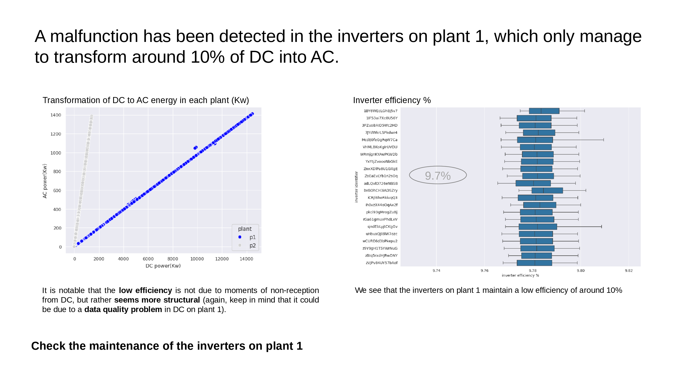
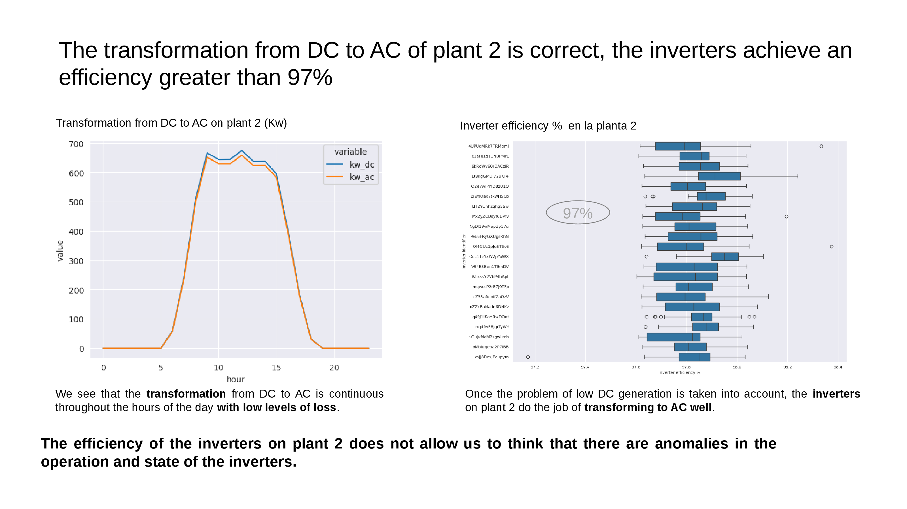

Update date: Dec 4, 2023

# **Detection of inefficiencies in solar plant**

## **Conclusions**

### **Objetive**

Analyze the available data to detect photovoltaic solar energy generation problems and whether or not it is necessary to transport a team of engineers to the plants.

### **Analysis context**

The photovoltaic solar energy generation company has detected anomalous behavior in 2 of its solar plants and the maintenance team has not been able to identify the reason.
To do this, before deploying a team of engineers, management has commissioned the preparation of a [analyze the data](detection_inefficiencies_solar_plant_BA.ipynb) from the sensors and meters to see if the problem can be detected.

### **Executive conclusions**

**ACC**

S2!