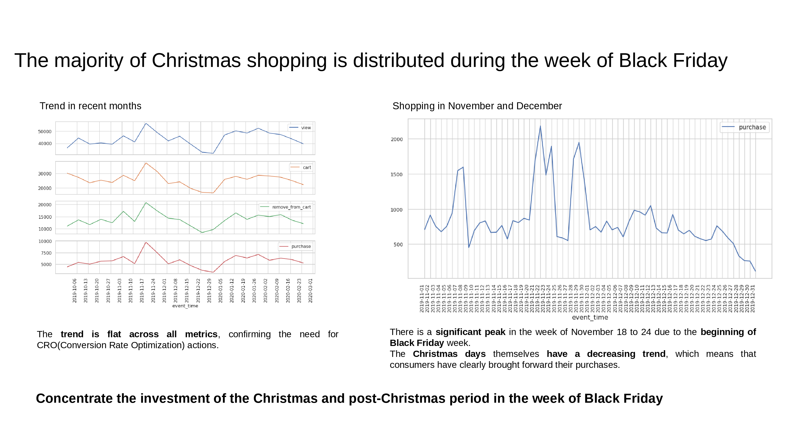
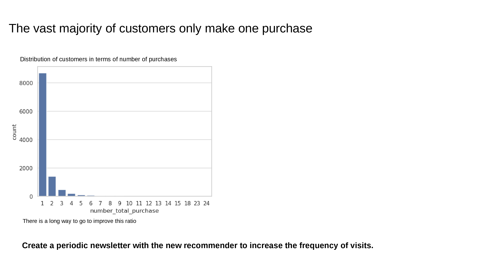
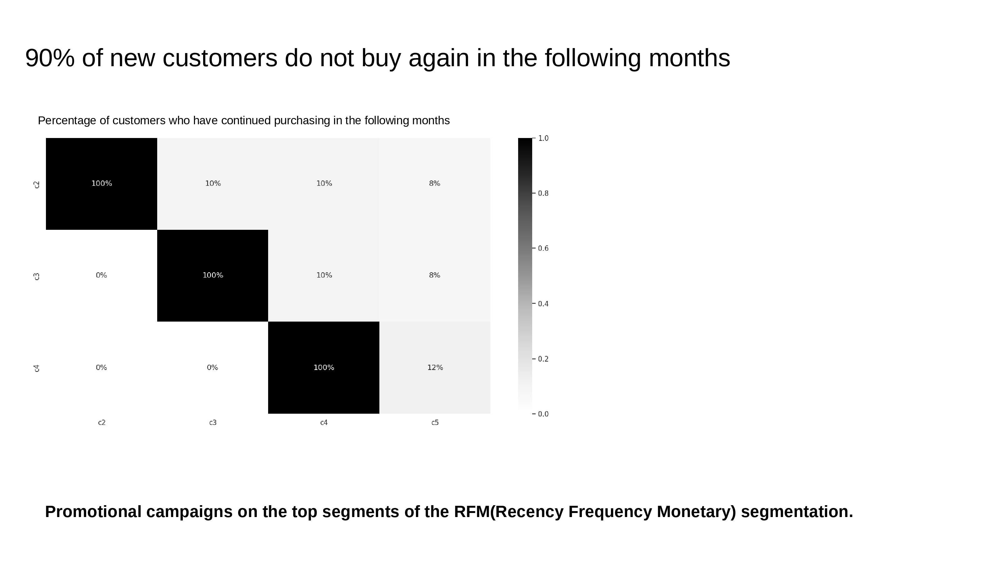
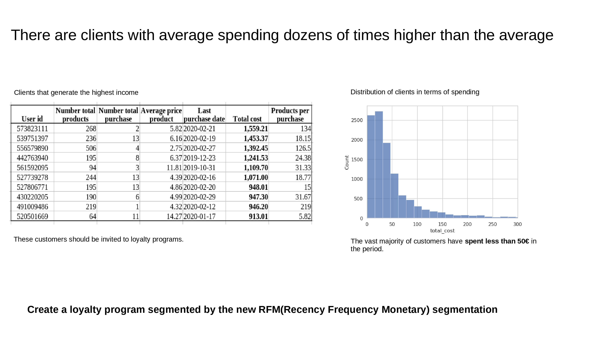
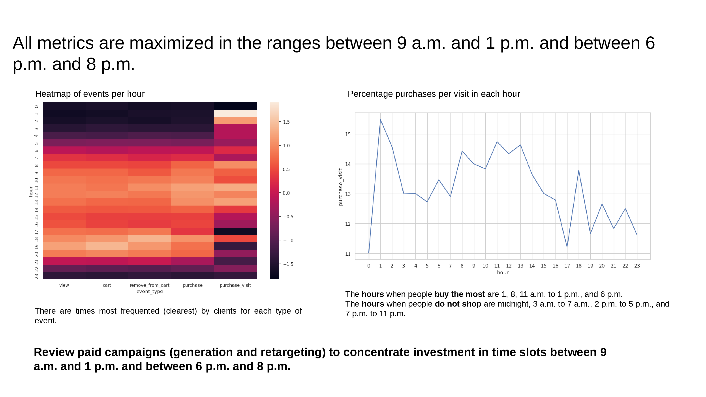
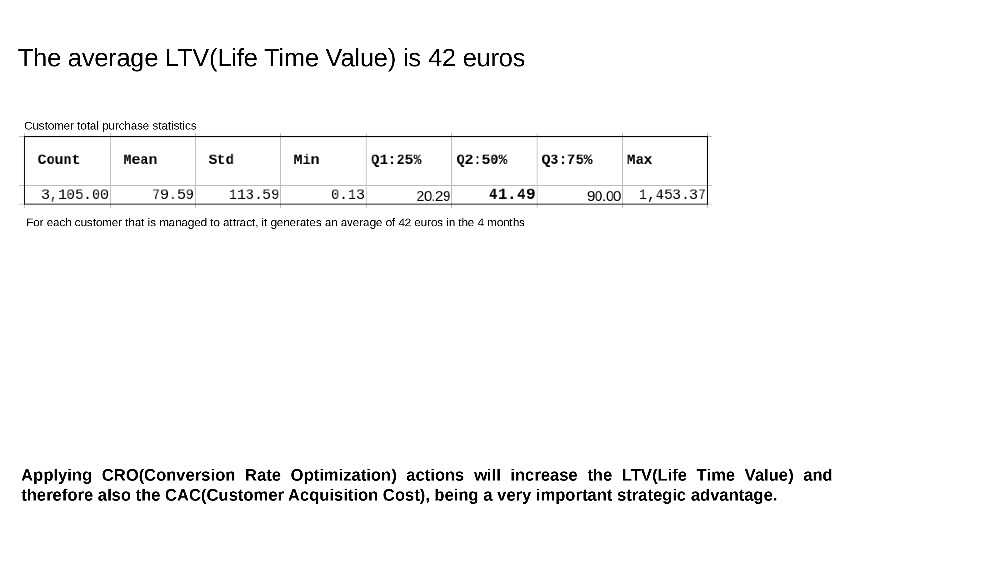
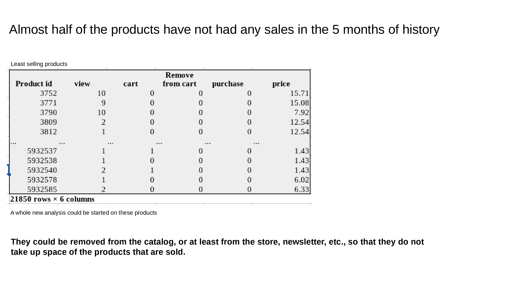

Update date: Dec 23, 2023

# **Ecommerce Optimization**

## **Conclusions**

### **Objetive**

Analyze transactional data of an e-commerce company in the cosmetics sector, to try potential CRO(Conversion Rate Optimization) actions that increase visits, conversions and average ticket, and therefore, increase the overall e-commerce turnover.

Create advanced analytical assets such as RFM(Recency Frequency Monetary) segmentation and a recommendation system that drives goal achievement.
### **Analysis context**

This company has had a flat evolution in recent months and has commissioned us to analyze its transactional data and implement CRO(Conversion Rate Optimization) actions personalized to its situation based on said analysis.
### **Executive conclusions**

**ACC**

S2!